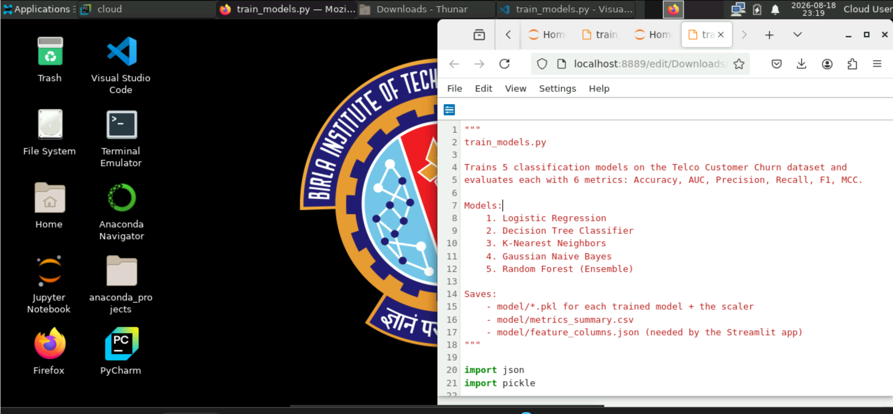

# 📡 Telco Customer Churn — Classification Project

A machine learning project that trains and compares 5 classification models to predict telecom customer churn, with an interactive Streamlit app for exploring results.

> Built for BITS Pilani WILP M.Tech (AIML/DSE) — Machine Learning, Assignment 2

---

## a. Problem Statement

Customer churn — when a subscriber stops using a company's service — is one of the most expensive problems in the telecom industry, since acquiring a new customer typically costs far more than retaining an existing one. This project builds and compares classification models to predict whether a telecom customer will churn, based on their account details, subscribed services, and billing information. The goal is to identify which model(s) best flag at-risk customers so that retention efforts (discounts, outreach, service improvements) can be targeted effectively rather than applied blindly to the entire customer base.

---

## b. Dataset Description

| | |
|---|---|
| **Source** | [Telco Customer Churn](https://www.kaggle.com/datasets/blastchar/telco-customer-churn) (Kaggle / IBM sample dataset) |
| **Rows** | 7,043 customers |
| **Raw columns** | 21 (1 identifier, 19 predictors, 1 target) |
| **Target** | `Churn` (Yes/No) → encoded as 1/0 |
| **Class balance** | ~26.5% churned, ~73.5% retained |

**Predictor categories:**
- **Demographics:** gender, SeniorCitizen, Partner, Dependents
- **Account info:** tenure, Contract type, PaperlessBilling, PaymentMethod, MonthlyCharges, TotalCharges
- **Subscribed services:** PhoneService, MultipleLines, InternetService, OnlineSecurity, OnlineBackup, DeviceProtection, TechSupport, StreamingTV, StreamingMovies

**Preprocessing steps:**
1. `customerID` dropped — identifier, no predictive value
2. 11 rows had blank `TotalCharges` (all with `tenure = 0`, i.e. brand-new customers not yet billed) → filled with 0
3. Categorical columns one-hot encoded (`pd.get_dummies`, `drop_first=True`)
4. **Final feature count: 30** (well above the assignment's 12-feature minimum)
5. **No target leakage** — `Churn` is the only target-related column in the raw dataset and was fully excluded from the feature matrix before training

---

## c. GitHub Repository

[https://github.com/Suriya-P/telco-churn-classifier](https://github.com/Suriya-P/telco-churn-classifier)

**Repository structure:**
```
telco-churn-classifier/
├── app.py                          # Streamlit app
├── requirements.txt                # Python dependencies
├── test_data.csv                   # Held-out test set (1,409 rows) used by the app
├── README.md                       # This file
├── data/
│   ├── raw/telco_churn.csv         # Original dataset
│   └── processed_telco_features.csv
├── model/
│   ├── feature_engineering.py      # Cleaning + one-hot encoding
│   ├── train_models.py             # Trains all 5 models, computes metrics
│   ├── logistic_regression.pkl
│   ├── decision_tree.pkl
│   ├── knn.pkl
│   ├── naive_bayes.pkl
│   ├── random_forest.pkl
│   ├── scaler.pkl                  # StandardScaler for LogReg/kNN
│   ├── feature_columns.json
│   └── metrics_summary.csv
├── notebooks/                      # BITS Virtual Lab execution notebook
└── screenshots/                    # Proof-of-execution screenshot
```

---

## d. Models Used

All 5 models were trained on an **80/20 stratified train-test split** (`random_state=42`) using the same 30-feature dataset, so comparisons are apples-to-apples. Logistic Regression and kNN were trained on **standardized** features (`StandardScaler`); Decision Tree, Naive Bayes, and Random Forest used raw features (tree-based / probability-based models don't require scaling).

### Comparison Table

| ML Model Name | Accuracy | AUC | Precision | Recall | F1 | MCC |
|---|---|---|---|---|---|---|
| Logistic Regression | 0.8070 | 0.8418 | 0.6584 | 0.5668 | 0.6092 | 0.4843 |
| Decision Tree | 0.8006 | 0.8219 | 0.6667 | 0.4973 | 0.5697 | 0.4515 |
| kNN | 0.7700 | 0.8083 | 0.5706 | 0.5401 | 0.5549 | 0.4004 |
| Naive Bayes | 0.6558 | 0.8096 | 0.4269 | 0.8663 | 0.5719 | 0.3951 |
| Random Forest (Ensemble) | 0.7630 | 0.8406 | 0.5402 | 0.7193 | 0.6170 | 0.4600 |

### Observations

| ML Model Name | Observation about model performance |
|---|---|
| **Logistic Regression** | Best overall accuracy (80.7%) and strong AUC (0.842). Churn drivers such as contract type, tenure, and monthly charges appear to have a largely linear relationship with churn, which suits a linear decision boundary well. Balanced precision/recall makes it a solid, interpretable baseline. |
| **Decision Tree** | Comparable accuracy to Logistic Regression (80.1%) but noticeably lower recall (0.497), meaning it misses more actual churners than it should. Capped at `max_depth=6` to control overfitting; a shallow tree trades some recall for simplicity and interpretability. |
| **kNN** | Middling performance across all metrics (77.0% accuracy). Distance-based classification is sensitive to the mix of one-hot encoded categorical features (many sparse 0/1 dimensions), which can dilute the influence of continuous features like tenure and charges even after scaling. |
| **Naive Bayes** | Lowest accuracy (65.6%) but by far the highest recall (0.866) — it catches most churners, at the cost of many false positives (precision only 0.427). This is expected: Naive Bayes assumes feature independence, which clearly doesn't hold here (e.g., `InternetService` and its dependent add-on services are correlated), but its bias toward flagging positives makes it useful if the business priority is "never miss a churner." |
| **Random Forest (Ensemble)** | Best F1 score (0.617) and second-best AUC (0.841), offering the most balanced trade-off between precision and recall. `class_weight="balanced"` was used to counter the 73/27 class imbalance, which noticeably improved recall (0.719) over the Decision Tree while keeping accuracy reasonable (76.3%). |
| **Overall Winner for this dataset** | **Logistic Regression** wins on raw accuracy/AUC, but **Random Forest** wins on the best precision/recall balance (F1 = 0.617). If the business cost of missing a churner is high, **Naive Bayes'** high recall is worth considering despite its lower accuracy. In practice, Random Forest is the most defensible "single pick" since it balances catching churners against not overwhelming retention teams with false alarms. |

---

## Streamlit App

**Live app link:** [https://telco-churn-classifier-fnvgvxk7aamfqezb9mb3q8.streamlit.app/](https://telco-churn-classifier-fnvgvxk7aamfqezb9mb3q8.streamlit.app/)

### Features
| Requirement | Implementation |
|---|---|
| **Dataset upload (CSV)** | Sidebar file uploader; falls back to bundled `test_data.csv` if no file is uploaded |
| **Model selection dropdown** | Sidebar dropdown to switch between all 5 trained models, with a one-line description of each |
| **Evaluation metrics display** | Accuracy, AUC, Precision, Recall, F1, and MCC shown as metric cards, computed live on the uploaded/selected data |
| **Confusion matrix / classification report** | Side-by-side confusion matrix heatmap and full per-class classification report table |
| **Bonus: model comparison view** | Optional expandable table + bar chart comparing all 5 models side by side |

### Screenshot


---

## How to Run Locally

```bash
# 1. Clone the repo
git clone <your-repo-url>
cd telco-churn-classifier

# 2. Create a virtual environment (recommended)
python -m venv venv
source venv/bin/activate   # Windows: venv\Scripts\activate

# 3. Install dependencies
pip install -r requirements.txt

# 4. Run the app
streamlit run app.py
```

To retrain the models from scratch:
```bash
cd model
python train_models.py
```

---

## Deployment

Deployed on **Streamlit Community Cloud**:
1. Push this repo to GitHub
2. Go to [streamlit.io/cloud](https://streamlit.io/cloud) → sign in with GitHub
3. New App → select this repo → branch `main` → main file `app.py` → Deploy

---

## Tech Stack

- **scikit-learn** — model training & evaluation
- **pandas / numpy** — data processing
- **matplotlib / seaborn** — confusion matrix visualization
- **Streamlit** — interactive web app

---

## Academic Integrity Note

This dataset (Telco Customer Churn), the specific feature engineering (11 blank `TotalCharges` handling, one-hot encoding scheme), model hyperparameters (`max_depth=6` for Decision Tree, `n_neighbors=15` for kNN, `class_weight="balanced"` for Random Forest), and the written observations above reflect original work for this assignment.
